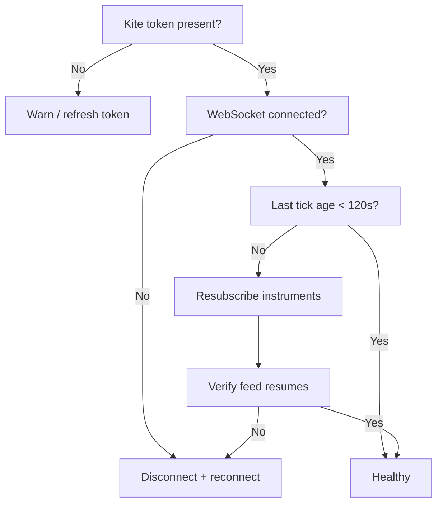
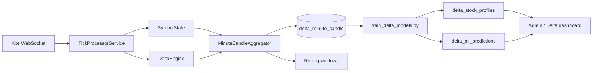

# NSE Automation, Cron Jobs, and ML Timings

This is the standalone operations document for the NSE platform.

## Daily Timeline

```mermaid
gantt
    title NSE Automation Timeline (IST)
    dateFormat  HH:mm
    axisFormat  %H:%M

    section Market Feed
    Delta connect / warmup         :a1, 09:00, 15m
    Delta subscribe instruments    :a2, 09:15, 1h
    Minute flush + paper trading   :a3, 09:16, 06h14m
    Freeze calculations            :milestone, a4, 15:30, 0m
    Save EOD summary               :milestone, a5, 15:31, 0m
    Clear memory / purge old data  :milestone, a6, 15:35, 0m

    section ML / Analytics
    ML rescore                     :a7, 09:00, 5m
    Intraday strategy snapshot     :milestone, a8, 15:20, 0m
    EOD prediction accuracy        :milestone, a9, 16:00, 0m
    Daily sync + analysis          :milestone, a10, 18:00, 0m
    Regime update                  :milestone, a11, 18:15, 0m
    Delta model retrain            :milestone, a12, 08:30, 0m
    News sentiment sync            :a13, 00:00, 24h
```

## What Runs Automatically

### Python backend scheduler

File: [backend/app/tasks/scheduler.py](backend/app/tasks/scheduler.py)

| Time (IST) | Days | Job | What it does |
|---|---|---|---|
| 18:00 | Mon-Fri | `daily_sync_job` | Full market sync: stock master, daily prices, liquid-universe pruning, corporate actions, indicators, pattern detection, ML predictions, sentiment, FII/DII, insider trading, intraday pick grading. |
| Every 1 hour | Always | `hourly_news_job` | Refreshes news sentiment. |
| 15:20 | Mon-Fri | `intraday_strategy_job` | Recomputes the 3:20 PM strategy Top-5 by P(+3%) before market close. |
| 18:15 | Mon-Fri | `update_regime_job` | Updates the daily regime context (VIX, expiry, gap day, trend). |
| 08:30 | Mon-Fri | `retrain_delta_models_job` | Retrains Level 2 / Level 3 delta models using the last 60 days of delta minute candles. |
| 09:00 | Mon-Fri | `rescore_ml_predictions_job` | Runs score-only ML pass so predictions are fresh for the trading day. |
| 16:00 | Mon-Fri | `eod_accuracy_job` | Computes hit rate, profit factor, calibration, and EOD accuracy metrics. |

### Delta service scheduler

File: [backend/java-market-ingest/src/main/java/com/nse/ingest/scheduler/MarketScheduler.java](backend/java-market-ingest/src/main/java/com/nse/ingest/scheduler/MarketScheduler.java)

| Time (IST) | Days | Job | What it does |
|---|---|---|---|
| 09:00 | Mon-Fri | `connectWebSocket()` | Loads averages, profiles, regime context, warms indicators, and connects Kite WebSocket. |
| Startup | Market hours | `onStartup()` | Auto-connects if token exists; warms indicators; subscribes; performs intraday gap fill. |
| 09:15 | Mon-Fri | `subscribeInstruments()` | Subscribes all DB-active instruments to Kite full feed. |
| Every minute | Mon-Fri | `flushMinuteCandles()` | Persists minute candles and runs paper-trading entry/exit checks. |
| Every minute | Mon-Fri | `feedWatchdog()` | Self-heal: if no tick arrives for 120s, force reconnect + resubscribe. |
| 15:30 | Mon-Fri | `freezeMarket()` | Stops live tick rolling for the market close. |
| 15:31 | Mon-Fri | `saveEod()` | Saves end-of-day summary. |
| 15:35 | Mon-Fri | `cleanupMemory()` | Clears memory and deletes minute candles older than 90 days. |
| 08:45 | Mon-Fri | `kiteTokenHealthCheck()` | Warns if Kite token is missing/expired before the open. |

### External watchdog

File: [backend/watchdog_delta.sh](backend/watchdog_delta.sh)

| Time (IST) | Days | Job | What it does |
|---|---|---|---|
| Every 5 minutes | Mon-Fri 09:15-15:30 | `watchdog_delta.sh` | Checks API, auth, websocket health, tick freshness, and SSE output. Refreshes token and reconnects if needed. |

## ML Training Timings

The ML path is split into three layers:

1. **Level 2 retrain** at **08:30 IST Mon-Fri**.
2. **Level 3 score-only refresh** at **09:00 IST Mon-Fri**.
3. **End-of-day accuracy evaluation** at **16:00 IST Mon-Fri**.

### Training data source

- `train_delta_models.py` uses the accumulated `delta_minute_candle` history.
- The retrain job uses the **last 60 days** of delta minute candles.
- Gap-fill replay rows are aligned to the same UTC wall-time as live rows, so the training set does not get duplicate shifted timestamps.

### Practical meaning

- **08:30 retrain** refreshes historical profile and ML model inputs before the session starts.
- **09:00 rescore** updates prediction scores so the morning dashboard starts with current model output.
- **15:20 strategy snapshot** generates actionable picks before the close.
- **16:00 accuracy job** measures how well predictions performed once the day is complete.

## Live Feed Self-Heal

## Delta Data Flow

## Notes

- The live delta feed now exposes a true heartbeat using `last_tick_age_seconds` and `last_tick_utc`.
- A connected socket is not enough; the watchdog also checks whether ticks are actually arriving.
- Gap-fill replay rows have zero buy/sell delta by design because historical Kite candles do not provide the split.
- The earlier timezone bug in gap-fill replay was fixed so replayed candles and live candles now line up correctly.
